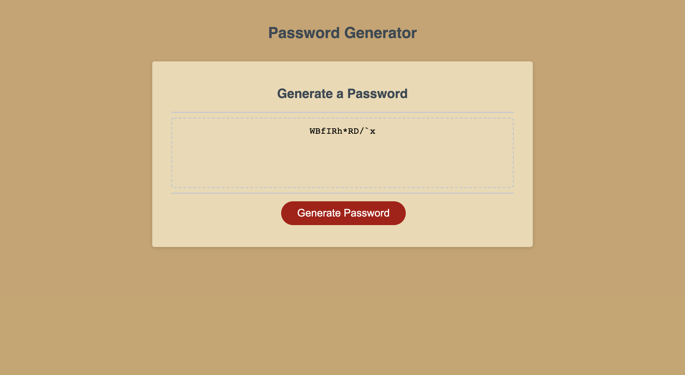

# Password_Generator

​
## Description 
This application enables employees to generate random passwords based on criteria that they’ve selected. It allows protection of sensitive data for great security. We've used Trilogy Education Services' starter code to create a clean and polished, responsive user interface that adapts to multiple screen sizes.

​
## Demo

This application can be found here:
* https://alenareh.github.io/Password_Generator/

The URL of the GitHub repository that contains the code of the application:
* https://github.com/AlenaReh/Password_Generator

## Contributors

- Alena Rehberger <https://github.com/AlenaReh>

​
## Credits

Thanks to w3schools <https://w3schools.com> and Trilogy Education Services for providing all of the necessery tools for building this application.